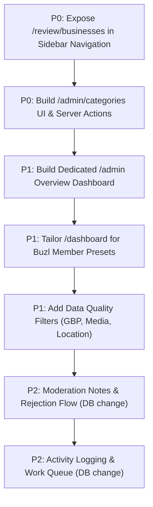

# Platform Admin & Buzl Member Feature Matrix

> Comprehensive Role, Capability, Priority & Architecture Matrix  
> Target System: Buzl Listing Platform  
> Date: 2026-09-18  
> Document Version: 1.0  
> Status: AUDIT COMPLETE — PENDING PRODUCT & ARCHITECTURE REVIEW

---

## 1. Role Definitions & Hierarchy

```
[Platform Admin] (admin)
  │
  ├── Full Platform Authority & Governance
  ├── Category / Taxonomy Structure
  ├── User Management & RBAC Presets
  └── All Moderation, Publication & Deletion Actions
        │
        ▼
[Buzl Member] (buzl_member)
  │
  ├── [Preset: Listing Manager] (listing_manager)
  │     ├── Operational Moderation Queue
  │     ├── Publication Approval & Suspension
  │     ├── Profile Import & Listing Creation
  │     └── Read-Only Category & Quality Directory
  │
  └── [Preset: Onboarding Member] (onboarding_member)
        ├── Business Profile JSON Import
        ├── 8-Step Listing Creation Wizard
        ├── Draft Editing & Submission for Review
        └── Read-Only Category Reference
              │
              ▼
[Business Owner] (business_owner)
  ├── External Business Profile Management
  ├── Self-Managed Business Creation & Edits
  └── Submission for Administrative Review
```

---

## 2. Comprehensive Capability Matrix

| Feature / Domain | Platform Admin | Buzl Listing Manager | Buzl Onboarding Member | Business Owner | Current Status | Priority | Requires DB Change? | Requires Product Decision? |
|---|:---:|:---:|:---:|:---:|:---:|:---:|:---:|:---:|
| **Platform Overview Dashboard (`/admin`)** | Full View (KPIs, queues, alerts) | Redirected | Redirected | Redirected | Missing (Redirects to `/admin/businesses`) | **P1** | NO | NO |
| **Member Overview Dashboard (`/dashboard`)** | Full View (System-wide) | Moderation focus (Queue, active reviews) | Creation focus (Drafts, imports) | Self-managed listings | Generic (Not role-customized) | **P1** | NO | YES (Layout details) |
| **Listings — View All Platform** | Full View | Moderated listings only | Self-managed only | Self-managed only | Implemented (`/admin/businesses`) | **P0** | NO | NO |
| **Listings — Search & Filter** | Search + status | Search + status | Search + status | Search + status | Partial (Missing category/city/verification filters) | **P0** | NO | NO |
| **Listings — Create Listing** | Full (8 steps) | Full (8 steps) | Full (8 steps) | Full (8 steps) | Implemented (`/dashboard/businesses/new`) | **P0** | NO | NO |
| **Listings — Edit Listing** | Full (All listings) | Full (Moderated/Self) | Self-managed drafts | Self-managed | Implemented (`/dashboard/businesses/[id]/edit`) | **P0** | NO | NO |
| **Listings — Import JSON Profile** | Full | Full | Full | Blocked | Implemented (`/admin/businesses/import`) | **P0** | NO | NO |
| **Listings — Submit for Review** | Auto-publishes | Submits / Approves | Submits to Pending | Submits to Pending | Implemented (`transitionPublication`) | **P0** | NO | NO |
| **Listings — Moderation Review Queue** | Full (`/review/businesses`) | Full (`/review/businesses`) | Blocked | Blocked | Implemented but **MISSING FROM SIDEBAR** | **P0** | NO | NO |
| **Listings — Approve / Publish** | Full authority | Full authority | Blocked | Blocked | Implemented (Enforced by DB RPC) | **P0** | NO | NO |
| **Listings — Suspend** | Full authority | Full authority | Blocked | Blocked | Implemented (Enforced by DB RPC) | **P0** | NO | NO |
| **Listings — Verify Badge** | Full authority | Blocked | Blocked | Blocked | Implemented (`setVerification`, Admin-only) | **P0** | NO | NO |
| **Listings — Delete / Purge** | Full authority | Blocked | Blocked | Blocked | Implemented (`deleteBusiness`, Admin-only) | **P0** | NO | NO |
| **Listings — Reject / Return with Notes** | Full | Full | Blocked | Receives feedback | **Missing** (No rejection feedback field) | **P1** | YES (`moderation_notes`) | YES (Review workflow) |
| **Category Management — View** | Full | Full | Full | Active only | DB exists; **NO UI** | **P0** | NO (Schema ready) | NO |
| **Category Management — Add / Edit** | Full | Blocked | Blocked | Blocked | **Missing** (Requires direct SQL) | **P0** | NO (Schema ready) | NO |
| **Category Management — Archive / Soft Delete** | Full (DB trigger guarded) | Blocked | Blocked | Blocked | **Missing** (Requires direct SQL) | **P0** | NO (Schema ready) | NO |
| **Category Management — Hierarchy / Parent** | Full | Read-only | Read-only | Read-only | **Missing UI** (`parent_id` exists in schema) | **P0** | NO (Schema ready) | NO |
| **Category Suggestion / Request** | Reviews requests | Can submit request | Can submit request | Blocked | **Missing** | **P2** | YES (`category_requests`) | YES |
| **User Management — List & Metrics** | Full (`/admin/users`) | Blocked | Blocked | Blocked | Implemented | **P0** | NO | NO |
| **User Management — Invite User** | Full (`/admin/users/new`) | Blocked | Blocked | Blocked | Implemented | **P0** | NO | NO |
| **User Management — Manage Roles & Presets** | Full (`/admin/users/[id]`) | Blocked | Blocked | Blocked | Implemented | **P0** | NO | NO |
| **User Management — Password Reset / Revoke** | Full (`/admin/users/[id]`) | Blocked | Blocked | Blocked | Implemented | **P0** | NO | NO |
| **Duplicate Detection — Live Inline Warnings** | Warning shown | Warning shown | Warning shown | Warning shown | Implemented (`checkDuplicates`) | **P0** | NO | NO |
| **Duplicate Management — Dedicated Review Queue**| Full | Review only | Blocked | Blocked | **Missing** (Only inline check exists) | **P2** | YES | YES |
| **Duplicate Management — Merge Review** | Manual review | Blocked | Blocked | Blocked | **Missing** (No auto-merge allowed) | **P3** | YES | YES |
| **Data Quality — Missing GBP Link Flag** | Visible in table/filter | Visible in table/filter | Blocked | Step 3 notice | **Missing** | **P1** | NO | NO |
| **Data Quality — Unverified Location Flag** | Visible in table/filter | Visible in table/filter | Blocked | Step 2 notice | **Missing** | **P1** | NO | NO |
| **Data Quality — Missing Media / Photos Flag** | Visible in table/filter | Visible in table/filter | Blocked | Step 8 checklist | **Missing in table** | **P1** | NO | NO |
| **Data Quality — Category Usage Counts** | Full count | Read-only | Read-only | Blocked | **Missing** | **P1** | NO | NO |
| **Reports — Listings by Status** | Full summary | Full summary | Self-managed | Self-managed | Implemented (`/dashboard` KPI cards) | **P0** | NO | NO |
| **Reports — Listings by Category / City** | Summary | Summary | Blocked | Blocked | **Missing** | **P2** | NO | NO |
| **Reports — Member Onboarding Throughput** | Full summary | Self throughput | Self throughput | Blocked | **Missing** | **P2** | NO | NO |
| **Activity / Audit Log** | Full log | Self activity | Self activity | Blocked | **Missing** (Only `updated_at` exists) | **P2** | YES (`audit_logs`) | YES |
| **Listing Assignment / My Queue** | Full assign | My assigned | My assigned | Blocked | **Missing** (No assignment columns) | **P2** | YES (`assigned_to`) | YES |
| **Bulk Operations — Bulk Publish / Suspend** | Batch action | Blocked | Blocked | Blocked | **Missing** | **P2** | NO | YES (Risk policy) |
| **Bulk Operations — Export CSV** | Full export | Self export | Blocked | Blocked | **Missing** | **P2** | NO | YES (Data export policy) |
| **Internal Notifications (In-app alerts)** | Alerts | Alerts | Alerts | Alerts | **Missing** (Only toasts exist) | **P2** | YES | YES |
| **Platform Settings — General & Policies** | Full | Blocked | Blocked | Blocked | **Missing** | **P3** | YES | YES |

---

## 3. Priority Breakdown

### P0 — Required Before Production Launch (Gatekeepers)
1. **Category Management Interface (`/admin/categories`)**:
   - Allows Platform Admins to view, create, edit, reorder, and archive categories.
   - Prevents engineering bottleneck for category maintenance.
   - Database schema and triggers are already 100% ready.
2. **Moderation Review Queue Discoverability**:
   - Expose `/review/businesses` in `Sidebar.tsx` with active indicator and pending count badge for Admins and Listing Managers.
3. **Listing Table Advanced Filters**:
   - Add Category, City/State, and Location Mode filters to `BusinessTableView`.
4. **Mobile Responsiveness for Listing Tables**:
   - Add stacked card view for `< md` viewports on `/admin/businesses` and `/dashboard/businesses` (matching the high standard set by `/admin/users`).

### P1 — Strongly Recommended (Quality & Operational Velocity)
1. **Dedicated Platform Admin Overview Dashboard (`/admin`)**:
   - High-level metric cards (Total Listings, Published, Pending, Suspended, Verified, Total Users, Platform Admins).
   - Direct attention widgets: "Pending Review Queue" snippet, "Recent Submissions", and "Quality Alerts".
2. **Tailored Buzl Member Dashboard (`/dashboard`)**:
   - Listing Managers: Focus on pending moderation queue and recently updated listings.
   - Onboarding Members: Focus on draft listings, imports, and quick creation actions.
3. **Data Quality Indicators**:
   - Filter listings by "Missing Google Business Profile (GBP) Link", "Unverified Location", or "Missing Cover/Logo".
4. **Rejection / Return to Draft with Moderation Notes**:
   - Allow Listing Managers and Admins to return a pending listing to draft with a clear feedback message explaining what the owner needs to fix.

### P2 — Post-Launch Enhancements
1. **Audit / Activity Logging (`activity_logs`)**:
   - Tracking who changed publication status, role, or business details with timestamps.
2. **Listing Assignment & Work Queues (`assigned_to`)**:
   - Allowing Admins to assign specific incoming listings to specific Buzl Members for review.
3. **Duplicate Comparison & Resolution Drawer**:
   - Side-by-side inspection for listings flagged by duplicate detection.
4. **Batch Import & Import History**:
   - Multi-file or bulk JSON import with execution logs and error recovery.
5. **Lightweight Operational Reports**:
   - Monthly onboarding throughput by member, geographical density heatmaps.

### P3 — Future Scope
1. **Automated GBP Sync**: Direct API integration with Google Business Profile API (requires OAuth/GBP permissions).
2. **Automated Website Generation**: DEC-032 future direction.
3. **Self-Service Category Requests**: Public or business owner request workflow.
4. **Automated Bulk Merging**: Explicitly rejected by architectural decision (all merges require manual review).

---

## 4. Dependencies & Next Steps


